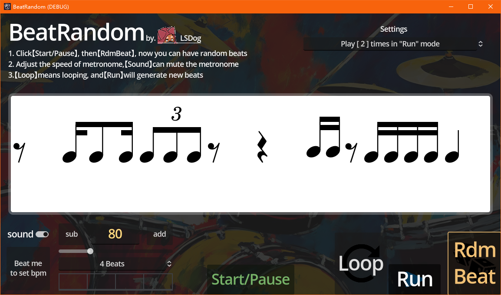
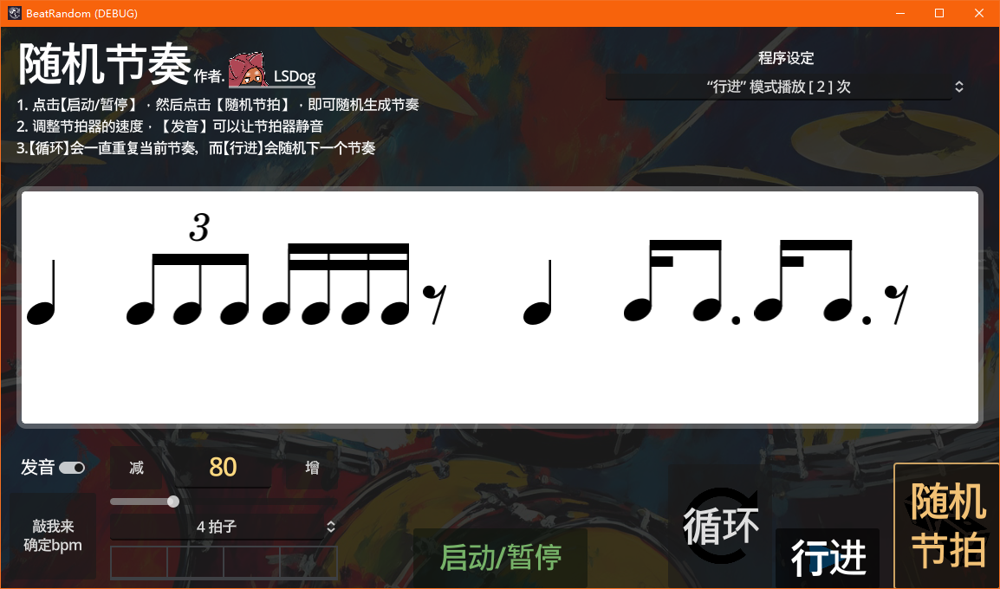

# 随机节奏 | BeatRandom 

</img>

> #### 锻炼你的节奏视奏能力！  
> #### Practice your beat sight-reading!  

 

## 🔘 功能 | Function

随机生成节奏型并播放节奏（只是播放不能交互游玩）  
Randomly generate rhythm and play the beats (Just play sound, no interaction)  

 

---
## 📷 截图 | ScreenShot

---

 

## 🚧 开发计划 | Dev plan

- 😵  
无，欢迎帮忙pr  
No, pr welcome  
